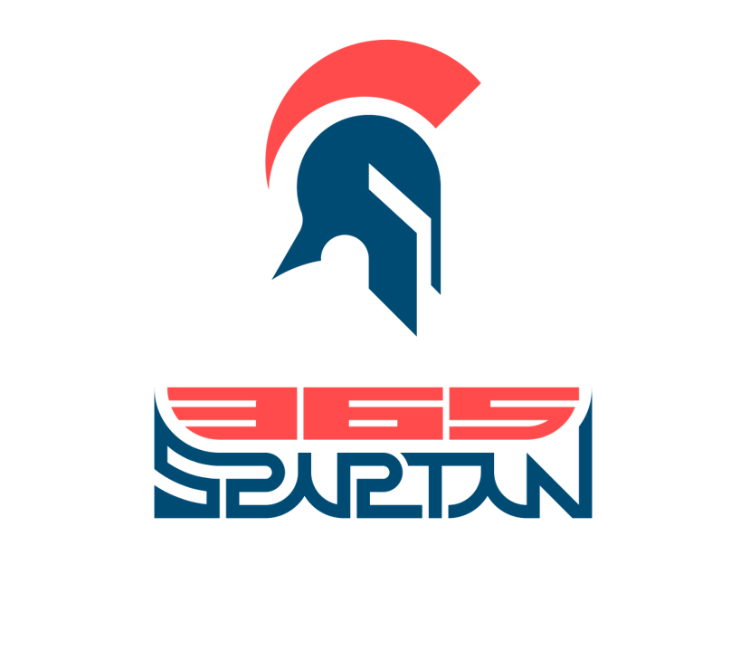

# 365 Spartan

**365 스파르탄**은 [스파르타코딩클럽][스파르타코딩클럽]에서 진행하는 알고리즘 동료 학습 프로젝트입니다.

☞365 스파르탄이란?
스파르타코딩클럽에서 진행하는 알고리즘 동료 학습 프로젝트입니다! 
60일 동안 매주 알고리즘 5문제를 푸는 것을 목표로 하며, 
한 주가 끝날 때마다 best 알고리즘 풀이를 선정하고 피드백 시간을 가지게 됩니다.

☞진행 방식
1. 60일간 매주 5문제를 풀어봅니다.
2. 풀어보았던 알고리즘 풀이 방식을 Github issue에 제출합니다. 
3. 한 주가 끝날 때마다 기수 내에서 좋은 코드를 매주 뽑아서 발표할 예정입니다! 
4. best 풀이를 보고, 서로 피드백 하는 시간을 가집니다.

☞활동 기간
1. 4월 12일부터 진행됩니다.
2. 참여 가능 한 날, 자유롭게 참여 가능하십니다^^

☞참여 혜택
1. 모든 참여자 분들에게는 수료증이 발급 됩니다!
2. 1등부터 5등까지 스파르타코딩클럽 3만원 할인쿠폰이 발급 됩니다!

60일 동안 매주 알고리즘 5문제씩 푸는 것을 목표로 하고 있습니다.
[블로그 작성 가이드][블로그 작성 가이드] 에 따라 블로그에 글을 작성합니다!
- 1️⃣ 문제 링크
- 2️⃣ 풀이 전 계획과 생각
- 3️⃣ 풀이 (코드 블록 첨부)
- 4️⃣ 풀이하면서 막혔던 점과 고민
- 5️⃣ 풀이 후 알게된 개념과 소감

[Github 가이드][Github 가이드]에 따라 Github Issue 에 댓글로 매 주차별 숙제를 제출합니다.

한 주가 끝날때마다 베스트 알고리즘 풀이를 선정합니다. 또한 이 과정에서 자유롭게 질문을 하고 서로의 의견을 남겨도 됩니다

## 지원방법
## 1기
절찬리 모집중입니다.
모집 방법은 [구글폼][구글폼]을 통해 4월 12일까지 받을 예정입니다!

### 일정

* [1주차 문제들][1주차 문제들]
* [2주차 문제들][2주차 문제들]
* [3주차 문제들]()
* [4주차 문제들]()
* [5주차 문제들]()

## 스터디 참여 현황

### 1기
| 참여자 (1) | 1주차 | 2주차 | 3주차 | 4주차 | 5주차 | 참석율 |
| --- | --- | --- | --- | --- | --- | --- |
| example |:white_check_mark:|:white_check_mark:|:white_check_mark:|| | 60.00% |
| kimth0526@gmail.com |||||| 0% |
| phs960418@gmail.com |||||| 0% |
| miseong1028@gmail.com  |||||| 0% |
| iamyoona@yonsei.ac.kr |||||| 0% |
| pkeowkd@naver.com |||||| 0% |
| cheryleduart@gmail.com |||||| 0% |
| LEEHyokyun |||||| 0% |
| genuinenameerror | 100% ||||| 0% |
| haamseongho |||||| 0% |
| simyoju | 40% ||||| 0% |
| dasom9536 |||||| 0% |
| Leejunmyung | 80% ||||| 0% |
| hyewon.park@mnsu.edu |||||| 0% |
| tkdcjf1230@naver.com |||||| 0% |
| june.sung.06@gmail.com |||||| 0% |
| herrakam |||||| 0% |
| hongcheol | 100% ||||| 0% |
| yeojeong.kim90@gmail.com |||||| 0% |
| chsw000@naver.com  |||||| 0% |
| phyw1129@naver.com |||||| 0% |
| 5agrvd@gmail.com |||||| 0% |
| kidonseo@gmail.com |||||| 0% |
| area363 | 100% ||||| 0% |
| gerherh |||||| 0% |

[스파르타코딩클럽]: https://spartacodingclub.kr/
[블로그 작성 가이드]: https://www.notion.so/teamsparta/92cefa0b72064c7f8ce44fa053792f2b
[Github 가이드]: https://www.notion.so/teamsparta/Github-4f3070b6fca646bdad04aaaf32a4bccf
[구글폼]: https://forms.gle/LR16Fsps69VyugBy9
[1주차 문제들]: https://github.com/TeamSparta-Inc/sparta-alogrithm-365/issues/2
[2주차 문제들]: https://github.com/TeamSparta-Inc/sparta-alogrithm-365/issues/4
